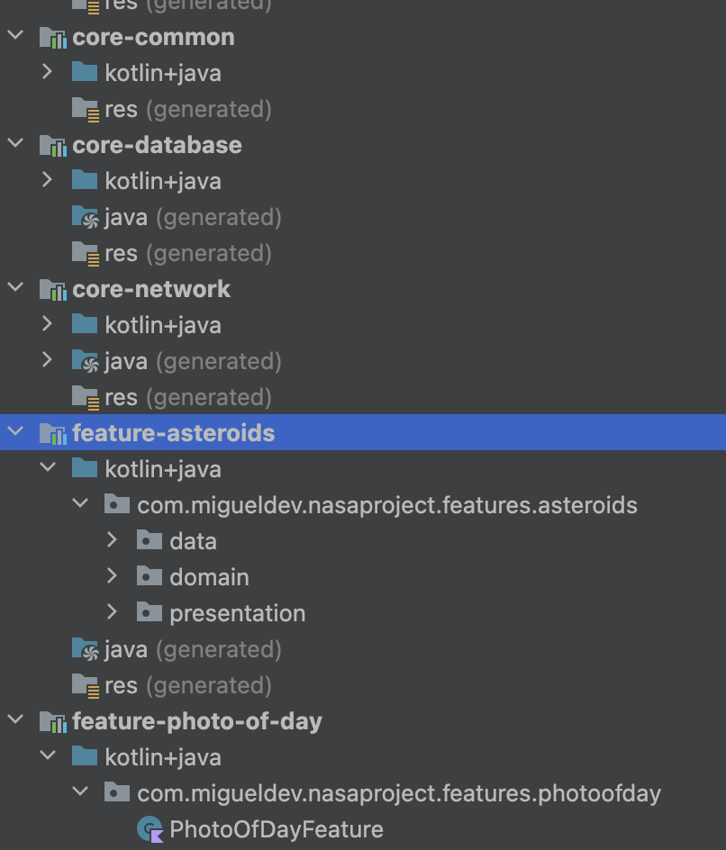

# Readme

## Opportunity

Testing: Unit Test, Integration Test, End2End Test 
CI/CD: pipelines integration 
UI/UX: Components, DarkMode, Atomic Design,  
Practice: Kotlin corutines, hillt DI, Modularization  

## main feature
Nasa Project based on api https://api.nasa.gov/  
show image of day 
show close astheroids 

## Current thechnology

Kotlin 
Compose 
hillt 
retrofit 

## Architecture

feature based architecture 
**Clean architecture:** Data, Domain, Presentation 
MVVM 
Modularization 

